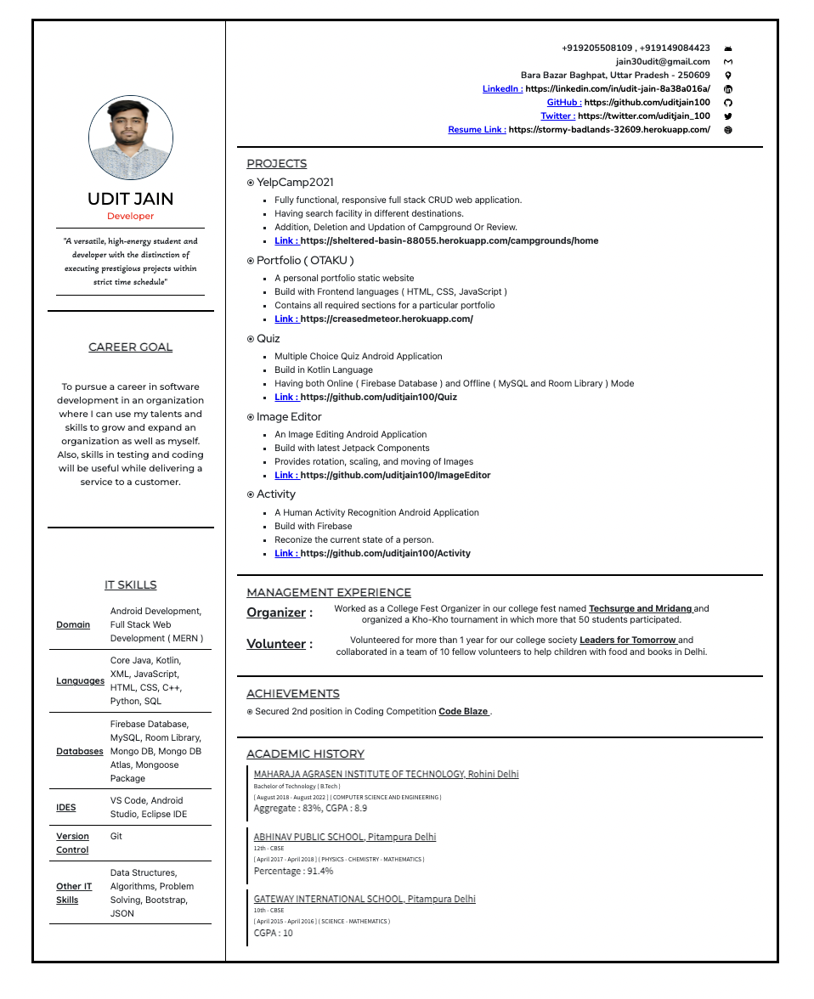

# 📝 Resume Builder — HTML + CSS Project

A responsive and visually appealing **Resume Web Page** built using only **HTML5** and **CSS3**. This project showcases a sample resume of _Udit Jain_, highlighting key professional information in a clean, printable layout with personal projects, achievements, education history, and contact details.

---

## 📷 Resume Preview

> 📌 Below is a sample screenshot of the resume rendered in a browser:



---

## 📁 Project Structure

```
resume-project/
│
├── index.html           # Main HTML file (Resume content)
├── app.css              # Styling rules and layout formatting
├── profile.jpg          # Profile image (used in resume)
└── screenshot.png       # Screenshot of rendered resume (add manually)
```

---

## 🎯 Features

- ✅ Clean, professional single-page resume layout
- 🎨 Designed entirely with **custom CSS**
- 📌 Key sections:
  - Career Goal
  - IT Skills
  - Contact Info (icons + links)
  - Major Projects
  - Management Experience
  - Academic History
  - Achievements
- 🖼️ Includes profile photo and linked social accounts
- 🧠 Bootstrap used via CDN for responsive layout

---

## 🚀 How to Use

1. **Clone the Repository**

   ```bash
   git clone https://github.com/your-username/resume-project.git
   cd resume-project
   ```

2. **Open in Browser**

   ```bash
   open index.html
   ```

   _(Or double-click `index.html` to launch in your browser.)_

3. **Customize Content**
   - Update `index.html` with your name, projects, skills, etc.
   - Replace `profile.jpg` with your own image.
   - Optionally, update styles in `app.css`.

---

## 🧰 Technologies Used

- HTML5
- CSS3 (custom styling + animations)
- Bootstrap 5 (CDN)
- Google Fonts (e.g., Montserrat, Nunito, Poppins)
- Simple Icons (for contact links)

---

## 👤 Author Info

- 👨‍💻 GitHub: [uditjain100](https://github.com/uditjain100)
- 💼 LinkedIn: [Udit Jain](https://linkedin.com/in/udit-jain-8a38a016a/)
- ✉️ Email: [jain30udit@gmail.com](mailto:jain30udit@gmail.com)

---
